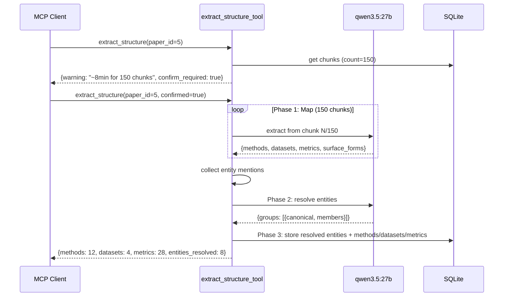

# Map-Reduce Extraction with Entity Resolution

**Date**: 2026-03-07
**Status**: Approved
**Related issues**: [#12](https://github.com/dutiona/knowledge-base/issues/12) (neo4j migration), [#13](https://github.com/dutiona/knowledge-base/issues/13) (deferred queue)

## Problem

`extract_structure()` truncates paper content at 8000 characters before sending to the LLM. For short papers (~6-15 pages), this captures most content. For long documents (theses, books, 300+ pages), everything after 8000 chars is silently ignored — methods, datasets, and metrics mentioned later are never extracted.

Additionally, cross-chunk entity references are not resolved: "our method" in chapter 6 is not linked to "CNN-LSTM architecture" defined in chapter 3.

## Decisions

| Decision             | Choice                                                                  |
| -------------------- | ----------------------------------------------------------------------- |
| Entity linking scope | All: entity resolution, metric attribution, cross-references            |
| LLM model            | qwen3.5:27b (Ollama), fits fully in 4090 24GB VRAM                      |
| LLM cost tolerance   | Correctness first; >2min requires warning + ETA + user confirmation     |
| Entity graph storage | New SQLite tables (`entities`, `entity_mentions`); neo4j tracked as #12 |
| LLM endpoint         | Configurable: Ollama native + OpenAI-compatible APIs                    |
| Extraction trigger   | Manual (`extract_structure_tool`); deferred queue tracked as #13        |

## Approach: Map-Reduce + Entity Resolution

Selected over two alternatives:

- **Flat Map-Reduce** (rejected): No entity graph. Cross-chunk linking fails for anything but identical names.
- **Full GraphRAG** (rejected): Community detection, hierarchical summarization. Massive over-engineering for structured extraction of methods/datasets/metrics.

## Section 1: Schema — Entity Resolution Tables

Two new tables added to `init_schema()`:

```sql
CREATE TABLE IF NOT EXISTS entities (
    id INTEGER PRIMARY KEY AUTOINCREMENT,
    canonical_name TEXT NOT NULL,
    entity_type TEXT NOT NULL CHECK(entity_type IN ('method', 'dataset', 'metric')),
    paper_id INTEGER NOT NULL REFERENCES papers(id),
    description TEXT,
    UNIQUE(canonical_name, entity_type, paper_id)
);

CREATE TABLE IF NOT EXISTS entity_mentions (
    id INTEGER PRIMARY KEY AUTOINCREMENT,
    entity_id INTEGER NOT NULL REFERENCES entities(id),
    surface_form TEXT NOT NULL,
    chunk_id INTEGER NOT NULL REFERENCES chunks(id),
    confidence REAL DEFAULT 1.0
);
```

**Relationship to existing tables**: `methods`/`datasets`/`metrics` remain the final output. `entities`/`entity_mentions` are the intermediate representation used during map-reduce. After entity resolution, resolved entities are written to `methods`/`datasets` using canonical names. Existing MCP tools (`get_methods`, `compare_papers`, etc.) work unchanged.

## Section 2: Configurable LLM Client

Replace hardcoded `_llm_extract` with a configurable client supporting both Ollama native and OpenAI-compatible APIs.

### New config keys (in `config` table)

| Key            | Default                           | Example                    |
| -------------- | --------------------------------- | -------------------------- |
| `llm_provider` | `ollama`                          | `openai_compat`            |
| `llm_base_url` | (auto-detected via `OLLAMA_HOST`) | `http://192.168.1.41:1234` |
| `llm_model`    | `qwen3.5:27b`                     | `qwen/qwen3.5-35b-a3b`     |

### Implementation

```python
def _llm_call(prompt: str, *, conn: sqlite3.Connection) -> str:
    cfg = _get_llm_config(conn)

    if cfg["provider"] == "ollama":
        # POST /api/generate — Ollama native (supports format="json")
        resp = httpx.post(f"{cfg['base_url']}/api/generate", json={
            "model": cfg["model"], "prompt": prompt,
            "stream": False, "format": "json",
        }, timeout=120)
        return resp.json()["response"]

    else:  # openai_compat
        # POST /v1/chat/completions — LM Studio, vLLM, Ollama /v1
        resp = httpx.post(f"{cfg['base_url']}/v1/chat/completions", json={
            "model": cfg["model"],
            "messages": [{"role": "user", "content": prompt}],
            "response_format": {"type": "json_object"},
        }, timeout=120)
        return resp.json()["choices"][0]["message"]["content"]
```

Ollama also exposes `/v1/chat/completions`, so `llm_provider=openai_compat` pointed at Ollama works too — single protocol across all backends.

## Section 3: Map-Reduce Extraction Pipeline

### Phase 1: Map (per-chunk extraction)

Each chunk gets its own LLM call. The prompt includes chunk position context (index/total) so the LLM knows where it is in the document.

```python
def _map_extract(chunk_id: int, chunk_text: str, chunk_index: int,
                 total_chunks: int, conn: sqlite3.Connection) -> dict:
    prompt = _MAP_PROMPT.format(
        text=chunk_text,
        chunk_index=chunk_index + 1,
        total_chunks=total_chunks,
    )
    raw = _llm_call(prompt, conn=conn)
    result = json.loads(raw)
    # Tag each extraction with its source chunk_id
    for item in result.get("methods", []):
        item["chunk_id"] = chunk_id
    for item in result.get("datasets", []):
        item["chunk_id"] = chunk_id
    for item in result.get("metrics", []):
        item["chunk_id"] = chunk_id
    return result
```

The map prompt requests **surface forms** — all names/aliases used to refer to each entity in the chunk:

```
For each method/dataset, include a "surface_forms" array with all names/aliases
used to refer to it in this chunk (e.g., ["our method", "CNN-LSTM", "the proposed approach"]).
```

### Phase 2: Entity Resolution (reduce)

After all map calls complete, collect every extracted entity name + surface forms + context snippet. A single LLM call groups them into canonical entities:

```python
def _resolve_entities(all_extractions: list[dict], conn: sqlite3.Connection) -> dict:
    entity_list = _collect_entity_mentions(all_extractions)
    prompt = _RESOLVE_PROMPT.format(entities=json.dumps(entity_list))
    raw = _llm_call(prompt, conn=conn)
    return json.loads(raw)
    # Returns: {"groups": [{"canonical": "CNN-LSTM",
    #           "members": ["our method", "the proposed approach", "CNN-LSTM"]}]}
```

Scales well: even for 300 chunks, the entity list is just names + short snippets — fits in 8k context.

### Phase 3: Store

Apply resolution map to deduplicate. Write to:

- `entities` + `entity_mentions` (new tables — intermediate representation)
- `methods` / `datasets` / `metrics` (existing tables — final output, using canonical names)

### Pipeline orchestration

```
chunks = get_chunks(paper_id)
estimated_seconds = len(chunks) * AVG_SECONDS_PER_CHUNK

if estimated_seconds > 120 and not confirmed:
    return {warning, estimated_seconds, confirm_required: true}

map_results = [_map_extract(...) for each chunk]
resolution = _resolve_entities(map_results, conn)
result = _store_resolved(conn, paper_id, map_results, resolution)
```



## Section 4: Short Document Fast Path

For papers under 8000 chars total, the current single-call approach is strictly better — no map-reduce overhead.

```python
total_chars = sum(len(c["content"]) for c in chunks)

if total_chars <= 8000:
    # Fast path: single LLM call, no entity resolution needed
    result = _extract_single_pass(conn, paper_id, chunks)
else:
    # Map-reduce path with ETA gate
    estimated_seconds = len(chunks) * AVG_SECONDS_PER_CHUNK
    if estimated_seconds > 120 and not confirmed:
        return {"warning": ..., "confirm_required": True}
    result = _extract_map_reduce(conn, paper_id, chunks)
```

- **Short papers** (typical 6-15 page research papers): 1 LLM call, ~3-5s. No regression.
- **Long documents** (books, theses): Map-reduce kicks in automatically.

## Section 5: Error Handling & Progress

### Partial failure recovery

Per-chunk errors are caught and logged. The pipeline continues past failures. Entity resolution and storage proceed with whatever succeeded.

```python
map_results = []
errors = []
for i, chunk in enumerate(chunks):
    try:
        result = _map_extract(chunk["id"], chunk["content"], i, len(chunks), conn)
        map_results.append(result)
    except Exception as e:
        errors.append({"chunk_id": chunk["id"], "chunk_index": i, "error": str(e)})
```

Return includes both results and errors:

```json
{"methods": 12, "datasets": 4, "metrics": 28, "chunks_failed": 3, "errors": [...]}
```

### Idempotency

Running extraction twice on the same paper produces the same result. Before storing, clear previous extraction data in FK-dependency order (metrics first, then entity_mentions, then entities, then datasets, then methods):

```python
def _clear_previous_extraction(conn, paper_id):
    conn.execute("DELETE FROM metrics WHERE paper_id = ?", (paper_id,))
    conn.execute("DELETE FROM entity_mentions WHERE entity_id IN "
                 "(SELECT id FROM entities WHERE paper_id = ?)", (paper_id,))
    conn.execute("DELETE FROM entities WHERE paper_id = ?", (paper_id,))
    conn.execute("DELETE FROM datasets WHERE paper_id = ?", (paper_id,))
    conn.execute("DELETE FROM methods WHERE paper_id = ?", (paper_id,))
```

Runs inside the same transaction as new inserts — atomic swap.

### LLM JSON parse failures

Same treatment as chunk errors — log and skip, don't abort the pipeline.

## Section 6: MCP Tool Interface Changes

### Modified: `extract_structure_tool`

New parameter:

| Parameter   | Type | Default | Description                     |
| ----------- | ---- | ------- | ------------------------------- |
| `confirmed` | bool | `False` | Skip the >2min ETA warning gate |

Return shape:

- **Under 2min or `confirmed=True`**: runs extraction, returns results
- **Over 2min and `confirmed=False`**: returns `{warning, estimated_seconds, chunk_count, confirm_required: true}`

### New: `configure_llm_tool`

```python
def configure_llm_tool(
    provider: str = "ollama",        # "ollama" or "openai_compat"
    base_url: str | None = None,     # e.g. "http://192.168.1.41:1234"
    model: str = "qwen3.5:27b",
) -> dict:
```

Validates by making a lightweight test call (list models endpoint) before saving config.

### New: `get_entities_tool`

```python
def get_entities_tool(paper_id: int) -> list[dict]:
    """List resolved entities for a paper with their mentions and surface forms."""
```

Returns:

```json
[
  {
    "id": 1,
    "canonical_name": "CNN-LSTM",
    "type": "method",
    "mentions": [
      { "surface_form": "our method", "chunk_id": 3, "confidence": 0.9 },
      {
        "surface_form": "CNN-LSTM architecture",
        "chunk_id": 12,
        "confidence": 1.0
      },
      {
        "surface_form": "the proposed approach",
        "chunk_id": 45,
        "confidence": 0.85
      }
    ]
  }
]
```

## Files to modify

| File                               | Change                                                                                                                                        |
| ---------------------------------- | --------------------------------------------------------------------------------------------------------------------------------------------- |
| `src/knowledge_base/db.py`         | Add `entities` + `entity_mentions` tables, default LLM config                                                                                 |
| `src/knowledge_base/extraction.py` | Replace `_llm_extract` with `_llm_call`, add map-reduce pipeline, entity resolution, fast path, ETA gate, error handling, idempotency cleanup |
| `src/knowledge_base/server.py`     | Add `configure_llm_tool`, `get_entities_tool`; update `extract_structure_tool` with `confirmed` param                                         |
| `tests/test_extraction.py`         | Tests for map-reduce, entity resolution, fast path, ETA gate, partial failures, idempotency, LLM config                                       |

## Out of scope (tracked separately)

- Neo4j migration for entity graph (#12)
- Deferred extraction queue with background processing (#13)
