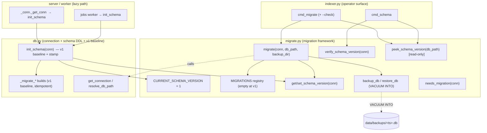

# Plan (Architecture-First): KB #450 — Schema-Version + Backup-Before-Migrate Framework

> **Lens.** This draft leads with the _structural ideal_: a clean migration-framework
> module with an obvious one-line extension point, a typed read/write API for the
> schema-version record, and crisp module boundaries between _schema definition_,
> _migration execution_, _backup/restore_, and _CLI/operator surface_. Expedience
> (e.g. "just stuff it in `db.py`") is considered only after the ideal boundary is
> drawn, and only where the ideal demands disproportionate cost.

---

## 1. BLUF

Introduce a **migration framework** to knowledge-base that mirrors the memory-engine
(ME) structural template (`~/dev/memory-engine/src/store/schema.rs`), adapted to KB's
Python/`sqlite3` reality:

- A `CURRENT_SCHEMA_VERSION = 1` constant + a `schema_version` record stored in the
  **existing** `config` key/value table (`db.py:628`), exactly as ME stores it in _its_
  `config` table (`schema.rs:111`, `schema.rs:157`).
- A **`MIGRATIONS` registry** — an ordered tuple of `(target_version, callable)` entries —
  that is _empty at v1_ and grows by **one line + one function** per future schema change.
  This is the structural payload of the issue: the extension point.
- An explicit **`migrate()`** path that takes a WAL-safe `VACUUM INTO` backup _before_
  mutating, runs each pending step in its own transaction, and on failure **restores the
  backup and aborts** (re-raising).
- A read-only **`verify_schema_version()`** + a read-only **`peek_schema_version()`** that
  report live-vs-current without mutating — the release-gate hook, mirroring ME's
  `validate_schema_version` (`schema.rs:290`) and `peek_schema_version_from_db`
  (`memory-engine-cli/src/db.rs:42`).
- Two new CLI subcommands on `knowledge-base-ingest`: **`migrate`** (`+ --check` dry-run)
  and **`schema`**, with ME's exact exit-code contract
  (`memory-engine-cli/src/commands/migrate.rs`, `.../schema.rs`).

**Key architectural decision (the crux):** the ~13 existing idempotent `_migrate_*` builds
(`db.py:912-927`) **stay as the v1 baseline** and continue to run inside `init_schema` for
_both_ fresh and legacy un-versioned DBs. They are the "bring any pre-#450 database up to
the v1 contract" layer. The **new framework sits _above_ them**: `init_schema` finishes the
v1 baseline, _stamps_ `schema_version=1` if absent, and then the **version-gated**
`MIGRATIONS` registry (v2+) is the _only_ place future DDL lands. This cleanly separates
**"converge any legacy DB to v1" (idempotent, content-sniffing)** from **"step v1→v2→…N"
(version-gated, transactional, backed-up)** — the two have different invariants and must
not be conflated.

---

## 2. The ME parity model (what we are mirroring, and where it diverges)

Read these before implementing; they are the canonical structure.

| Concern            | ME (Rust) location                                         | KB (Python) target                             |
| ------------------ | ---------------------------------------------------------- | ---------------------------------------------- |
| Version constant   | `schema.rs:8` `CURRENT_SCHEMA_VERSION`                     | `migrate.py` `CURRENT_SCHEMA_VERSION = 1`      |
| Version record     | `config` table, key `schema_version` (`schema.rs:111/157`) | `config` table, key `schema_version`           |
| Registry shape     | `MIGRATIONS: &[(MigrationFn, bool)]` (`schema.rs:172`)     | `MIGRATIONS: tuple[Migration, ...]`            |
| Migration fn type  | `fn(&Connection) -> Result<()>` (`schema.rs:168`)          | `Callable[[sqlite3.Connection], None]`         |
| Migrate loop       | `migrate(conn, backup_dir)` (`schema.rs:200`)              | `migrate(conn, *, backup_dir, db_path)`        |
| Backup             | `backup_before_migration` `VACUUM INTO` (`schema.rs:364`)  | `backup_db(db_path, backup_dir)` `VACUUM INTO` |
| Read-only verify   | `validate_schema_version` (`schema.rs:290`)                | `verify_schema_version(conn)`                  |
| Read-only peek     | `peek_schema_version_from_db` (`cli/db.rs:42`)             | `peek_schema_version(db_path)`                 |
| Config get/set     | `get_config`/`set_config` (`schema.rs:121/157`)            | `get_schema_version`/`set_schema_version`      |
| CLI `migrate`      | `commands/migrate.rs`                                      | `indexer.py:cmd_migrate`                       |
| CLI `schema`       | `commands/schema.rs`                                       | `indexer.py:cmd_schema`                        |
| Exit-code contract | `migrate.rs:114-123`, `schema.rs:50-54`                    | mirror exactly (see §7)                        |

**Deliberate divergences (justified, not accidental):**

1. **`restore-on-fail` is explicit in KB; implicit in ME.** ME relies on per-step
   transaction rollback — a failed migration `tx` rolls back, the version is not bumped,
   and the pre-migration `VACUUM INTO` backup simply _remains on disk_ as a manual safety
   net (`migrate.rs:44-45` "the transactional chain rolls back and the pre-migration backup
   remains"). The KB issue explicitly asks for **"on failure RESTORES + aborts"**, so KB's
   `migrate()` goes one step further: on any step failure it closes the live connection,
   copies the backup file back over the live DB path (and removes WAL/SHM sidecars), then
   re-raises. This is a _stronger_ guarantee than ME and is the acceptance criterion
   "a failed migrate restores the backup."

2. **No `STORAGE_EPOCH` at v1.** ME carries a coarse `STORAGE_EPOCH` gate
   (`schema.rs:16`, `schema.rs:206-217`) for breaking-architectural-change signalling.
   At KB v1 there is exactly one epoch and no second one is on the horizon; adding an epoch
   constant now is **speculative generality**. The _structure_ leaves room for it (the
   verify/peek functions read `config`, so a `storage_epoch` key can be added later as a
   one-line gate), but we do not ship a dead constant. **Flag for review:** if the user
   wants strict ME parity including epoch, it is a 3-line addition — called out in §11.

3. **KB `VACUUM INTO` cannot run inside a transaction.** SQLite forbids `VACUUM` inside an
   explicit transaction. The backup therefore happens _before_ the per-step transaction
   loop opens — same ordering as ME (`schema.rs:236-239`).

---

## 3. Module boundary decision (the central architectural choice)

### 3.1 Options considered

**Option A — new `migrate.py` module (CHOSEN).**
A dedicated `src/knowledge_base/migrate.py` owns: `CURRENT_SCHEMA_VERSION`, the
`MIGRATIONS` registry, `get_schema_version`/`set_schema_version`, `migrate`,
`verify_schema_version`, `peek_schema_version`, `backup_db`, `restore_db`,
`needs_migration`. `db.py` imports `CURRENT_SCHEMA_VERSION` + `set_schema_version` for the
fresh-init stamp; `migrate.py` imports `get_connection`/`resolve_db_path` from `db.py`.

**Option B — everything inside `db.py`.**
Append the framework to the bottom of `db.py` next to the `_migrate_*` builds.

**Option C — a `migrations/` package** with one module per version.

### 3.2 Decision: Option A

- **Cohesion.** `db.py` is already 928 lines and conflates _connection management_,
  _schema DDL_, _legacy idempotent migrations_, and _domain query helpers_
  (`co_occurrence_pairs`, `insert_chunk_vec`, …). The migration **framework** is a
  distinct concern with distinct invariants (versioning, backup, transactional stepping).
  A separate module is the clean seam.
- **Mirrors ME.** ME isolates this in `store/schema.rs`, separate from the engine's query
  surface. Option A is the direct Python analogue.
- **Dependency direction stays acyclic.** `migrate.py → db.py` (for `get_connection`,
  `resolve_db_path`, and the `_migrate_*` baseline reference) is a clean one-way edge.
  `db.py`'s only reverse need is `CURRENT_SCHEMA_VERSION` + `set_schema_version` for the
  fresh-init stamp; to avoid a cycle, **the version constant and the config get/set helpers
  live in `migrate.py`, and `db.py` imports them** (a leaf import, no cycle, since
  `migrate.py`'s import of `db.py` is only used at call-time inside functions, not at
  module top-level for those symbols — see §4.1 for the precise import shape).
- **Option C rejected:** 1 migration (v1 baseline, zero registry entries) does not justify
  a package; it is premature structure. The registry-of-callables _is_ the extension
  mechanism, and adding a `migrations/` package later is non-breaking if ever warranted.
- **Option B rejected:** worsens an already-overloaded module and buries the new public
  surface among 30 private helpers.

### 3.3 Resulting boundaries (target architecture)



**The seam in one sentence:** `db.py` owns _"what the v1 schema is and how to converge any
legacy DB to it"_; `migrate.py` owns _"what version the DB is, how to step it forward
safely, and how to report/back-up/restore."_

---

## 4. Detailed design

### 4.1 `migrate.py` — the framework module

```python
"""Schema versioning + backup-before-migrate framework (KB #450).

Mirrors memory-engine's store/schema.rs: a CURRENT_SCHEMA_VERSION constant, a
MIGRATIONS registry of ordered (version, callable) steps, a transactional
migrate() that takes a WAL-safe VACUUM INTO backup first and restores it on
failure, and read-only verify/peek helpers for the release gate.

Extension point: to add schema v(N) -> v(N+1), append ONE entry to MIGRATIONS
and write ONE module-level `_migrate_vN_to_vN1(conn)` function. Bump
CURRENT_SCHEMA_VERSION. Nothing else changes.
"""
from __future__ import annotations

import shutil
import sqlite3
from collections.abc import Callable
from datetime import datetime, timezone
from pathlib import Path

__all__ = [
    "CURRENT_SCHEMA_VERSION",
    "MIGRATIONS",
    "MigrationError",
    "backup_db",
    "get_schema_version",
    "migrate",
    "needs_migration",
    "peek_schema_version",
    "restore_db",
    "set_schema_version",
    "verify_schema_version",
]

#: The schema version this code targets. v1 == the current (pre-#450) schema:
#: the full init_schema DDL plus every idempotent _migrate_* baseline build in
#: db.py. Bump to 2 when the first version-gated migration is added below.
CURRENT_SCHEMA_VERSION = 1

Migration = tuple[int, Callable[[sqlite3.Connection], None]]

#: Ordered, gap-free, forward-only migration registry. EMPTY at v1 because the
#: v1 schema is materialised by init_schema + the db.py baseline builds. Each
#: entry is (target_version, fn): fn upgrades a DB that is already at
#: (target_version - 1) to target_version. The migrate() loop runs every entry
#: whose target_version is in (live, CURRENT_SCHEMA_VERSION].
#:
#: Example future entry (do NOT add until a real v2 lands):
#:     (2, _migrate_v1_to_v2),
MIGRATIONS: tuple[Migration, ...] = ()
```

**Public API surface (the contract other modules depend on):**

| Function                | Signature                                              | Role                                                     | ME analogue                                    |
| ----------------------- | ------------------------------------------------------ | -------------------------------------------------------- | ---------------------------------------------- |
| `get_schema_version`    | `(conn) -> int`                                        | read `config['schema_version']`, default `1` if absent   | `get_config` + parse (`schema.rs:201`)         |
| `set_schema_version`    | `(conn, version: int) -> None`                         | upsert `config['schema_version']`                        | `set_config` (`schema.rs:157`)                 |
| `peek_schema_version`   | `(db_path) -> int`                                     | **read-only** transient connection peek, no init/migrate | `peek_schema_version_from_db` (`cli/db.rs:42`) |
| `needs_migration`       | `(conn) -> bool`                                       | `get_schema_version(conn) < CURRENT_SCHEMA_VERSION`      | implied by `migrate.rs:53`                     |
| `verify_schema_version` | `(conn) -> None`                                       | raise `MigrationError` on mismatch/missing; else return  | `validate_schema_version` (`schema.rs:290`)    |
| `backup_db`             | `(db_path, backup_dir, version) -> Path`               | `VACUUM INTO` timestamped copy; return its path          | `backup_before_migration` (`schema.rs:364`)    |
| `restore_db`            | `(backup_path, db_path) -> None`                       | copy backup over live DB, drop WAL/SHM sidecars          | (KB-only; ME leaves backup on disk)            |
| `migrate`               | `(conn, *, db_path, backup_dir=None) -> MigrateResult` | the orchestrator (§4.4)                                  | `migrate` (`schema.rs:200`)                    |

**Import shape (cycle avoidance).** `migrate.py` imports `get_connection`/`resolve_db_path`
**lazily inside `peek_schema_version`** (the only function that opens its own connection),
not at module top level. `db.py` imports `CURRENT_SCHEMA_VERSION` and `set_schema_version`
at top level from `migrate.py`. Because `migrate.py`'s top-level body imports nothing from
`db.py`, the edge `db.py → migrate.py` is a clean leaf import with no cycle.

> **Decision — get/set/version-constant live in `migrate.py`, imported by `db.py`.**
> This keeps the _single source of truth_ for the version in the framework module and makes
> the dependency arrow point the natural way (schema definition depends on the version it
> stamps). The alternative (constant in `db.py`) would force `migrate.py → db.py` for the
> constant _and_ `db.py → migrate.py` for nothing, i.e. a needless reverse edge.

### 4.2 `get_schema_version` / `set_schema_version`

```python
def get_schema_version(conn: sqlite3.Connection) -> int:
    """Live schema version from config; defaults to 1 for un-stamped DBs.

    A pre-#450 database has no 'schema_version' key. By the time this is called
    inside init_schema, the db.py baseline builds have converged it to the v1
    contract, so the correct default is 1 (the baseline IS v1).
    """
    row = conn.execute(
        "SELECT value FROM config WHERE key = 'schema_version'"
    ).fetchone()
    if row is None:
        return 1
    try:
        return int(row["value"] if isinstance(row, sqlite3.Row) else row[0])
    except (ValueError, TypeError) as exc:
        raise MigrationError(f"invalid schema_version in config: {row!r}") from exc


def set_schema_version(conn: sqlite3.Connection, version: int) -> None:
    conn.execute(
        "INSERT INTO config (key, value) VALUES ('schema_version', ?) "
        "ON CONFLICT(key) DO UPDATE SET value = excluded.value",
        (str(version),),
    )
    conn.commit()
```

Mirrors ME's upsert (`schema.rs:158-162`). The `config` table already has
`key TEXT PRIMARY KEY` (`db.py:629-632`), so `ON CONFLICT(key)` is valid.

### 4.3 `peek_schema_version` (read-only, the release-gate primitive)

```python
def peek_schema_version(db_path: Path) -> int:
    """Read schema_version WITHOUT initializing or migrating.

    Opens a transient read-only connection (sqlite ?mode=ro URI) so the release
    gate / `schema` CLI can inspect a stale DB the writable path would otherwise
    mutate. Mirrors ME peek_schema_version_from_db (cli/db.rs:42).
    """
    if not db_path.is_file():
        raise MigrationError(f"database not found: {db_path}")
    uri = f"file:{db_path}?mode=ro"
    conn = sqlite3.connect(uri, uri=True, timeout=30.0)
    try:
        conn.row_factory = sqlite3.Row
        return get_schema_version(conn)
    finally:
        conn.close()
```

**Why read-only and separate from `get_connection`:** `get_connection` (`db.py:179`) loads
`sqlite_vec` and sets `PRAGMA journal_mode=WAL` (a _write_ to the DB header). The
release-gate `schema` command must be able to report a mismatch on a DB it must not touch
(e.g. a newer-than-binary DB, or a DB mid-rollback). This is exactly why ME peeks read-only
without opening the engine (`cli/db.rs:38-41`). It also avoids the sqlite-vec extension
dependency for a pure version read.

### 4.4 `migrate()` — the orchestrator (backup → step → restore-on-fail)

```python
@dataclass(frozen=True)
class MigrateResult:
    schema_version: int        # live version before this call
    current_schema_version: int
    pending: tuple[int, ...]   # versions applied (or that would apply)
    migrated: bool             # True iff DDL was actually run
    backup_path: Path | None   # the VACUUM INTO backup, if one was taken


def migrate(
    conn: sqlite3.Connection,
    *,
    db_path: Path,
    backup_dir: Path | None = None,
) -> MigrateResult:
    """Run forward-only migrations from the live version to CURRENT_SCHEMA_VERSION.

    1. Read live version. If newer than CURRENT -> MigrationError (forward-incompatible).
    2. If equal -> no-op (stamp if missing), return migrated=False.
    3. Take a WAL-safe VACUUM INTO backup (when backup_dir given and DB is on disk).
    4. For each (target, fn) in MIGRATIONS with live < target <= CURRENT:
         run fn(conn) inside a transaction; on success bump schema_version=target
         and commit; on ANY exception -> rollback, restore the backup over db_path,
         re-raise.
    Mirrors ME migrate() (schema.rs:200) but adds explicit restore-on-fail (issue req).
    """
    live = get_schema_version(conn)
    current = CURRENT_SCHEMA_VERSION

    if live > current:
        raise MigrationError(
            f"database schema_version {live} is NEWER than CURRENT_SCHEMA_VERSION "
            f"{current}; this build cannot migrate it forward"
        )

    pending = tuple(v for (v, _fn) in MIGRATIONS if live < v <= current)
    if not pending:
        # already current — stamp un-versioned-but-current DBs (the v1 baseline case)
        if get_schema_version_raw(conn) is None:
            set_schema_version(conn, current)
        return MigrateResult(live, current, (), migrated=False, backup_path=None)

    backup_path = None
    if backup_dir is not None:
        backup_path = backup_db(db_path, backup_dir, live)  # VACUUM INTO, outside any txn

    try:
        for target, fn in MIGRATIONS:
            if not (live < target <= current):
                continue
            conn.execute("BEGIN")
            fn(conn)
            set_schema_version(conn, target)  # inside the txn
            conn.commit()
    except Exception:
        conn.rollback()
        if backup_path is not None:
            restore_db(backup_path, db_path)  # copy backup back over the live DB
        raise

    return MigrateResult(live, current, pending, migrated=True, backup_path=backup_path)
```

**Transaction granularity decision.** ME wraps **each step** in its own transaction
(`schema.rs:247-260`) so a partial chain leaves the DB at the last _successfully committed_
intermediate version. KB does the same (one `BEGIN…commit()` per registry entry). Rationale:
if v1→v2 commits but v2→v3 fails, the DB is validly at v2, the backup is restored to the
_pre-migrate_ state, and re-running `migrate` resumes from v2. Per-step transactions also
keep each `set_schema_version` atomic with its DDL.

> **Subtlety flagged for review — restore vs per-step commit interaction.** With
> _explicit restore-on-fail_ AND _per-step commits_, a v1→v2 success followed by a v2→v3
> failure will (a) roll back the v2→v3 txn, then (b) restore the _pre-migrate_ backup,
> discarding the committed v2. This is the **safe, conservative** choice: the operator ends
> up exactly where they started, with a backup on disk, and reruns cleanly. The alternative
> (keep the committed v2, only roll back v3) is _also_ defensible but leaves the DB in a
> half-migrated on-disk state if restore is skipped. Recommendation: **restore to
> pre-migrate** (matches the issue's "restores the backup" literally). Leave the call to the
> user in review; both are one-line changes.

### 4.5 `backup_db` / `restore_db` — WAL-safe copy boundary

```python
def backup_db(db_path: Path, backup_dir: Path, current_version: int) -> Path:
    """WAL-safe timestamped backup via VACUUM INTO. Returns the backup path.

    VACUUM INTO produces a single defragmented, transactionally-consistent file
    regardless of WAL state — no -wal/-shm sidecars to manage. Mirrors ME
    backup_before_migration (schema.rs:364).
    """
    backup_dir.mkdir(parents=True, exist_ok=True)
    ts = datetime.now(timezone.utc).strftime("%Y%m%dT%H%M%SZ")
    backup_path = backup_dir / f"{db_path.stem}.v{current_version}.{ts}.db"

    # Defense-in-depth: reject NUL before any FS/SQL use (VACUUM INTO cannot
    # parameterize its target). Mirrors ME's null-byte guard (schema.rs:389).
    target = str(backup_path)
    if "\x00" in target:
        raise MigrationError("backup path contains null byte")
    if backup_path.exists():
        backup_path.unlink()

    # VACUUM INTO does not support bound parameters; escape single quotes ('->'').
    # The path is operator-controlled (backup_dir derives from db_path / a flag),
    # validated for NUL above. Mirrors ME's escaping (schema.rs:407-408).
    escaped = target.replace("'", "''")
    # NB: VACUUM cannot run inside a transaction; callers must invoke this BEFORE
    # opening the per-step migration transaction.
    conn = _backup_source_connection(db_path)
    try:
        conn.execute(f"VACUUM INTO '{escaped}'")
    finally:
        conn.close()
    return backup_path


def restore_db(backup_path: Path, db_path: Path) -> None:
    """Restore a backup over the live DB, removing stale WAL/SHM sidecars.

    Called only on migration failure. The caller has already closed/rolled back
    its transaction; we replace the file bytes and drop sidecars so the next
    open() sees a clean, consistent v(pre-migrate) database.
    """
    shutil.copyfile(backup_path, db_path)
    for sidecar in (db_path.with_name(db_path.name + "-wal"),
                    db_path.with_name(db_path.name + "-shm")):
        if sidecar.exists():
            sidecar.unlink()
```

**Boundary decisions:**

- **`backup_db` opens its own short-lived connection** (`_backup_source_connection`) rather
  than receiving the live `conn`. Reason: `VACUUM INTO` must not run inside the live
  connection's pending transaction, and it issues a `COMMIT`-like checkpoint; isolating it
  on a dedicated connection keeps the orchestrator's connection state predictable. This
  helper can simply be `sqlite3.connect(str(db_path), timeout=30.0)` — no sqlite-vec needed
  for `VACUUM INTO`.
- **`restore_db` operates on file paths, not connections.** Restore is a filesystem
  operation by nature (replace the DB file). Keeping it path-based means it has no
  dependency on connection state and is trivially testable.
- **Timestamp format** `YYYYMMDDTHH MM SSZ` (UTC, ISO-8601 basic, colon-free) → filesystem-safe,
  lexically sortable, matches the issue's "timestamped backup" and is friendlier than ME's
  `.v{n}.bak` (which is _not_ timestamped — a deliberate KB improvement, since the issue
  explicitly requires timestamps).

### 4.6 Backup directory boundary

- **Default:** `<db_path>.parent / "backups"`. For the production DB
  (`~/.local/share/knowledge-base/knowledge.db`, `db.py:38`) this is
  `~/.local/share/knowledge-base/backups/`. This mirrors ME placing the backup _next to the
  database_ (`cli/db.rs:88` `path.parent()`), generalized to a `backups/` subfolder so the
  data dir stays tidy.
- **Override:** `migrate --backup-dir PATH` CLI flag → threads into `migrate(backup_dir=…)`.
- The issue text says `data/backups/<timestamp>.db`. KB's runtime DB does not live under a
  repo `data/` dir; the _architecturally correct_ anchor is "beside the live DB," which is
  what ME does and what survives a non-default `--db-path`. **Flag for review:** if the user
  wants a literal repo-relative `data/backups/`, that is a one-line default change in
  `cmd_migrate`; the framework takes whatever `backup_dir` it is handed.

---

## 5. The `init_schema` / `migrate` relationship (does init auto-migrate or only stamp?)

This is the second crux. ME's answer (`schema.rs:96-114`): **fresh DB → create latest +
stamp; existing DB → return immediately and let `migrate()` evolve it.** KB cannot adopt
that verbatim because KB's `init_schema` is _also_ the legacy-convergence layer (the
`_migrate_*` builds) that every server/worker start relies on (`_conn.py:22`, `jobs.py:137`).

### Chosen behavior

`init_schema` (`db.py:626`) is extended **minimally**:

1. Run the existing v1 baseline unchanged (config table, full DDL, all 13 `_migrate_*`
   builds, lines `626-927`). This converges _any_ pre-#450 DB to the v1 contract — fresh or
   legacy. **This is the v1 definition and must not move into the registry.**
2. **After** the baseline, stamp the version idempotently:
   ```python
   from .migrate import CURRENT_SCHEMA_VERSION, get_schema_version, set_schema_version
   # at the very end of init_schema, after conn.commit():
   if get_schema_version_raw(conn) is None:
       # un-stamped DB just converged to the v1 baseline -> stamp it v1
       set_schema_version(conn, 1)
   # else: leave the stamp as-is; version-gated upgrades are migrate()'s job
   ```
3. `init_schema` **does NOT run the `MIGRATIONS` registry.** It only _stamps_. Version-gated
   v2+ steps are applied **exclusively** by the explicit `migrate` CLI path (which backs up
   first). This is the safety property: the long-running server's lazy init never silently
   rewrites tables under load — it only ever materializes the v1 baseline and stamps.

> **Why init stamps-but-does-not-migrate (architectural rationale).** Auto-migrating inside
> the server's lazy `_get_conn` (`_conn.py:14`) would mean a destructive, backup-requiring
> table rebuild could fire on the first query after a binary upgrade, mid-request, with no
> backup and no operator in the loop. By making `migrate` an **explicit, backed-up,
> exit-coded operator action** and leaving `init_schema` as **"converge to v1 + stamp,"** we
> get a clean release-gate workflow: deploy new binary → `knowledge-base-ingest schema`
> (verify, non-zero if stale) → `knowledge-base-ingest migrate` (backup + step) → start
> server. This is precisely ME's separation (`migrate.rs:37-45`): the writable engine path
> migrates with a backup; the read path validates only.

### Forward-compatibility note (when v2 lands)

When the first real v2 migration is added, a pre-existing v1 DB opened by the server's
`init_schema` will be **stamped v1** (already is) and the server will **keep operating on
the v1 schema** until an operator runs `migrate`. If a v2 code path requires a v2 column,
that code must guard on `get_schema_version(conn) >= 2` (or the deploy runbook must run
`migrate` before starting the server). This is the _same_ contract ME documents
(`schema.rs:88-92`: existing DB returns immediately, evolution happens through `migrate`).
**This is called out in §9 Documentation** so the v2 author inherits the rule.

---

## 6. CLI surface (`indexer.py`)

Add two subcommands mirroring ME (`commands/migrate.rs`, `commands/schema.rs`). The existing
dispatch dict (`indexer.py:287-293`) and `build_parser` (`indexer.py:202`) are the seams.

### 6.1 `schema` — release-gate verify (read-only)

```python
def cmd_schema(args: argparse.Namespace) -> None:
    from .migrate import CURRENT_SCHEMA_VERSION, peek_schema_version
    live = peek_schema_version(args.db)          # read-only, never mutates
    current = CURRENT_SCHEMA_VERSION
    matches = live == current
    _print({"schema_version": live,
            "current_schema_version": current,
            "matches": matches}, quiet=args.quiet)
    sys.exit(0 if matches else 1)
```

Mirrors `schema.rs:50-54` exit contract: `0` on match, `1` on any mismatch. **Read-only** —
uses `peek_schema_version`, never `_get_conn` (which would init/WAL-touch the DB).

### 6.2 `migrate` (+ `--check`) — backed-up forward migration

```python
def cmd_migrate(args: argparse.Namespace) -> None:
    from .migrate import (CURRENT_SCHEMA_VERSION, MIGRATIONS, migrate,
                          peek_schema_version)
    live = peek_schema_version(args.db)
    current = CURRENT_SCHEMA_VERSION
    newer = live > current
    pending = [v for (v, _fn) in MIGRATIONS if live < v <= current]

    if args.check or newer or not pending:
        _print({"schema_version": live, "current_schema_version": current,
                "pending": pending, "migrated": False, "checked": args.check,
                "newer": newer}, quiet=args.quiet)
        # exit non-zero if a release gate must act: newer DB, or pending in --check
        sys.exit(1 if (newer or (args.check and pending)) else 0)

    # real migration: open writable, backup-first, step, restore-on-fail
    backup_dir = args.backup_dir or (args.db.parent / "backups")
    conn = get_connection(args.db)
    try:
        init_schema(conn)                  # converge to v1 baseline + stamp
        result = migrate(conn, db_path=args.db, backup_dir=backup_dir)
    finally:
        conn.close()
    _print({"schema_version": result.schema_version,
            "current_schema_version": result.current_schema_version,
            "pending": list(result.pending), "migrated": result.migrated,
            "checked": False, "newer": False,
            "backup_path": str(result.backup_path) if result.backup_path else None},
           quiet=args.quiet)
    sys.exit(0)
```

**Exit-code contract (mirrors `migrate.rs:114-123` exactly):**

| Situation                          | `migrate` exit                                 | `migrate --check` exit | `schema` exit |
| ---------------------------------- | ---------------------------------------------- | ---------------------- | ------------- |
| up-to-date (live == current)       | `0`                                            | `0`                    | `0`           |
| pending (live < current)           | `0` (after applying)                           | `1` (status signal)    | `1`           |
| newer than binary (live > current) | `1` (cannot migrate)                           | `1`                    | `1`           |
| genuine migration failure          | `1` (`KnowledgeBaseError` path, after restore) | n/a                    | n/a           |

The migration-failure path re-raises a `MigrationError` (subclass of `KnowledgeBaseError`,
§4.1), which the existing `main()` try/except (`indexer.py:295-299`) turns into an
`{"error": …}` line on stderr + `sys.exit(1)` — _after_ `restore_db` has run. This reuses
the established error boundary rather than inventing a new one.

### 6.3 Parser wiring

```python
# in build_parser(), after the `status` subparser (indexer.py:259):
p_migrate = sub.add_parser("migrate", help="Back up, then apply pending schema migrations.")
p_migrate.add_argument("--check", action="store_true",
                       help="Dry-run: report pending migrations, exit 1 if any. No mutation.")
p_migrate.add_argument("--backup-dir", dest="backup_dir", type=Path, default=None,
                       help="Backup directory (default: <db>/../backups).")
sub.add_parser("schema", help="Report live schema_version vs CURRENT_SCHEMA_VERSION.")

# in main()'s dispatch dict (indexer.py:287):
"migrate": cmd_migrate,
"schema": cmd_schema,
```

**`_make_args` test-helper note:** the existing `tests/test_indexer.py:_make_args`
(`test_indexer.py:74`) builds a bare `Namespace`; the new commands need `backup_dir`/`check`
defaults, so tests for them must pass those (or `_make_args` gains the defaults — see §8).

---

## 7. Ordered implementation steps

> TDD throughout: each step writes the failing test first, watches it fail, then implements.

1. **Create `src/knowledge_base/migrate.py`** with `CURRENT_SCHEMA_VERSION=1`, empty
   `MIGRATIONS`, `MigrationError`, and `get_schema_version`/`set_schema_version`. Add
   `MigrationError` to `exceptions.py` (subclass `KnowledgeBaseError`).
   _Test first:_ `test_migrate.py::test_current_version_is_one`,
   `::test_get_set_schema_version_roundtrip`.

2. **`peek_schema_version`** (read-only). _Test:_ peek on a stamped DB returns the stamp;
   peek on a missing file raises `MigrationError`; peek does **not** create `-wal`/`-shm`.

3. **`backup_db` / `restore_db`.** _Test:_ backup of a populated DB creates a sortable
   timestamped file in `backup_dir`; the backup is a valid SQLite DB with the same row
   counts; `restore_db` overwrites a mutated live DB back to the backup's contents and
   removes sidecars; NUL in path raises.

4. **`migrate()` orchestrator** (with empty registry: pure no-op + stamp paths).
   _Test:_ on a fresh-init DB, `migrate` returns `migrated=False`, version unchanged;
   on an un-stamped-but-baseline DB, `migrate` stamps `1`; on a forged `schema_version=99`
   DB, `migrate` raises (newer-than-binary).

5. **`migrate()` failure/restore path** using a **temporary test-only registry entry**.
   _Test:_ monkeypatch `migrate.MIGRATIONS = ((2, _boom),)` and
   `migrate.CURRENT_SCHEMA_VERSION = 2`, where `_boom` raises after a partial write; assert
   the live DB is byte-restored to its pre-migrate state, the version is still `1`, and the
   backup file exists. This exercises the extension point end-to-end **without** shipping a
   real v2. (Also a _happy-path_ registry test: a `_noop_v2` that adds a throwaway table,
   asserting the registry-driven loop bumps the version to 2 and runs the fn — proving the
   one-line extension contract.)

6. **Extend `init_schema`** (`db.py`): import from `migrate.py`, add the end-of-function
   stamp (§5). Add a private `get_schema_version_raw` helper (returns `None` when the key is
   absent, distinct from the defaulting `get_schema_version`) so the stamp is idempotent and
   never clobbers an explicit version. _Test (in `test_db.py`):_
   - `test_fresh_db_stamps_current_version` — fresh `init_schema` → `schema_version == 1`
     (acceptance: "Fresh DB initializes at CURRENT_SCHEMA_VERSION").
   - `test_legacy_unstamped_db_stamped_v1` — build a pre-#450 schema (reuse the existing
     legacy-DB fixtures at `test_db.py:289`/`:335`/`:417`), run `init_schema`, assert it is
     stamped `1` and all baseline columns exist.
   - `test_init_schema_does_not_run_registry` — with a monkeypatched non-empty `MIGRATIONS`,
     `init_schema` must **not** apply it (only `migrate` does).

7. **Add `cmd_schema` + `cmd_migrate` + parser wiring** (`indexer.py`). _Test (in
   `test_indexer.py`):_
   - `test_cmd_schema_matches_exit_0` / `test_cmd_schema_mismatch_exit_1` (forge a stale
     stamp).
   - `test_cmd_migrate_check_up_to_date_exit_0`.
   - `test_cmd_migrate_check_pending_exit_1` (monkeypatched registry).
   - `test_cmd_migrate_newer_exit_1` (forge `schema_version=99`).
   - `test_cmd_migrate_applies_and_backs_up` (monkeypatched 2-step registry: assert a backup
     file appears in `backup_dir`, version becomes current, `migrated=True`).
   - `test_cmd_migrate_failure_restores` (monkeypatched failing registry: assert restore +
     `sys.exit(1)`).
   - `test_build_parser_subcommands` extended to include `migrate`/`schema`
     (`test_indexer.py:87`).

8. **`__all__` updates:** export the new public symbols from `migrate.py` (already in its
   `__all__`); no change needed to `db.py.__all__` (`init_schema` already exported,
   `db.py:32`).

9. **Documentation** (§9) and **README/ROADMAP** touch-ups.

10. **Verification** (§10): full pytest, ruff, pyright; manual CLI smoke against a temp DB.

---

## 8. Testing strategy

**New file `tests/test_migrate.py`** — the framework unit tests (steps 1-5 above). Key
fixtures:

- `tmp_path`-based real on-disk DB (the framework needs a _file_ DB for `VACUUM INTO`,
  `peek`, and `restore`; in-memory cannot back up — see `schema.rs:374-376`).
- A `make_v1_db(tmp_path)` helper: `get_connection` + `init_schema`, returns `(conn, path)`.
- A **registry monkeypatch pattern** (the heart of the extension-point coverage):
  ```python
  def test_registry_drives_one_line_extension(tmp_path, monkeypatch):
      from knowledge_base import migrate as m
      calls = []
      def _v2(conn): calls.append(2); conn.execute("CREATE TABLE _probe (x)")
      monkeypatch.setattr(m, "MIGRATIONS", ((2, _v2),))
      monkeypatch.setattr(m, "CURRENT_SCHEMA_VERSION", 2)
      conn, path = make_v1_db(tmp_path)
      res = m.migrate(conn, db_path=path, backup_dir=tmp_path / "backups")
      assert res.migrated and m.get_schema_version(conn) == 2 and calls == [2]
  ```
  This _proves_ the architectural claim "adding a v2 is a one-line registry entry + a
  function" with an executable test, and is the canonical template the future v2 author
  copies.

**Extend `tests/test_db.py`** — the `init_schema` stamp/baseline tests (step 6). Reuse the
existing legacy-schema `executescript` fixtures (`test_db.py:289`, `:335`, `:417`) so the
"legacy un-stamped DB → stamped v1" path is covered against _realistic_ pre-#450 shapes.

**Extend `tests/test_indexer.py`** — CLI exit-code + backup-file tests (step 7). Add
`backup_dir`/`check` defaults to `_make_args` (`test_indexer.py:74`) or pass them per-call.
Use `pytest.raises(SystemExit)` and assert `.value.code` for the exit-code contract.

**Coverage matrix (maps directly to acceptance criteria):**

| Acceptance criterion                                 | Test                                                                                                   |
| ---------------------------------------------------- | ------------------------------------------------------------------------------------------------------ |
| Fresh DB initializes at `CURRENT_SCHEMA_VERSION`     | `test_db.py::test_fresh_db_stamps_current_version`                                                     |
| Migrate creates a timestamped backup before mutating | `test_indexer.py::test_cmd_migrate_applies_and_backs_up`, `test_migrate.py::test_backup_db_*`          |
| Version mismatch is reportable                       | `test_indexer.py::test_cmd_schema_mismatch_exit_1`, `::test_cmd_migrate_newer_exit_1`                  |
| A failed migrate restores the backup                 | `test_migrate.py::test_migrate_failure_restores`, `test_indexer.py::test_cmd_migrate_failure_restores` |
| Extension point is one line + one fn                 | `test_migrate.py::test_registry_drives_one_line_extension`                                             |

---

## 9. Documentation

1. **`docs/reference/schema.md`** — add a **"Schema versioning & migrations"** section:
   the `config['schema_version']` record, the `CURRENT_SCHEMA_VERSION` constant, the
   `MIGRATIONS` registry shape, and **the v2-author rule** (init stamps-but-does-not-migrate;
   version-gated DDL goes in the registry only; new code requiring a v2 column must guard on
   `get_schema_version >= 2` or rely on the deploy runbook running `migrate`). Add `config`
   to the ER diagram already present (`schema.md:11-14`) with a note that `key` includes
   `schema_version`.

2. **`docs/usage/`** — a short **"Migrating the database"** page: the deploy/release-gate
   workflow (`schema` to verify → `migrate --check` in CI → `migrate` to apply), the backup
   location, and the restore-on-fail guarantee. Mirror the framing of ME's
   `migrate.rs` doc-comment (release-gate contract).

3. **Module docstring** in `migrate.py` (already drafted in §4.1) — the canonical
   "how to add a migration" instructions live next to the registry.

4. **`docs/reference/mcp-tools.md` / CLI help** — the argparse `help=` strings (§6.3) are
   the inline contract; ensure `migrate --check` and `schema` are discoverable.

5. **`ROADMAP.md`** — tick #450 and note ME-parity achieved (mirrors the cross-repo parity
   tracking in the project memory).

---

## 10. Verification commands

Run from the worktree root `/home/mroynard/dev/knowledge-base/.worktrees/450-schema-version-migrate`:

```bash
# 1. Targeted new tests (watch them fail first per TDD, then pass)
uv run pytest tests/test_migrate.py -v
uv run pytest tests/test_db.py -k "schema_version or stamp or registry" -v
uv run pytest tests/test_indexer.py -k "migrate or schema" -v

# 2. Full suite — no regressions in the existing 13-build init path
uv run pytest -q

# 3. Lint + format + types
uv run ruff format --check .
uv run ruff check .
uv run pyright src/knowledge_base/migrate.py src/knowledge_base/db.py src/knowledge_base/indexer.py

# 4. Manual CLI smoke (fresh DB -> schema -> migrate --check -> migrate)
TMPDB="$(mktemp -d)/kb.db"
uv run knowledge-base-ingest --db-path "$TMPDB" status              # creates + inits the DB
uv run knowledge-base-ingest --db-path "$TMPDB" schema; echo "schema exit=$?"        # expect matches=true, exit 0
uv run knowledge-base-ingest --db-path "$TMPDB" migrate --check; echo "check exit=$?"  # expect pending=[], exit 0
uv run knowledge-base-ingest --db-path "$TMPDB" migrate; echo "migrate exit=$?"        # expect migrated=false, exit 0

# 5. Verify the version is stamped and the read-only peek works
uv run python -c "from pathlib import Path; from knowledge_base.migrate import peek_schema_version, CURRENT_SCHEMA_VERSION; import os; p=Path(os.environ['TMPDB']); print('live', peek_schema_version(p), 'current', CURRENT_SCHEMA_VERSION)"

# 6. Confirm a non-default backup dir is honored (no write to the live dir on --check)
uv run knowledge-base-ingest --db-path "$TMPDB" migrate --backup-dir "$(mktemp -d)" --check; echo "exit=$?"
```

Expected: all pytest green; ruff/pyright clean; `schema` and `migrate --check` exit `0` on a
fresh DB; `peek_schema_version` prints `live 1 current 1`.

---

## 11. Risks, edge cases, and flagged decisions

1. **`VACUUM INTO` availability.** Requires SQLite ≥ 3.27 (2019). KB already depends on
   FTS5 + sqlite-vec + WAL; the bundled `sqlite3` in Python 3.12 (`requires-python>=3.12`,
   `pyproject.toml:11`) is far newer. Low risk; note it in the migrate docstring.

2. **Restore-vs-per-step-commit semantics** — flagged in §4.4. Recommendation: restore to
   _pre-migrate_ state (literal reading of the issue). One-line change if the user prefers
   "keep committed intermediate versions."

3. **`STORAGE_EPOCH` omission** — flagged in §2. Recommendation: omit at v1 (no second epoch
   exists); the verify/peek functions already read `config`, so a `storage_epoch` gate is a
   later 3-line addition. Call to the user.

4. **Backup directory anchor** (`<db>/../backups` vs literal repo `data/backups/`) — flagged
   in §4.6. Recommendation: anchor beside the live DB (survives `--db-path`, matches ME).
   One-line default change if the user wants repo-relative.

5. **`init_schema` import cost.** Adding `from .migrate import …` at `db.py` top level pulls
   a tiny pure-Python module (no heavy deps) — negligible. The reverse (`migrate.py`
   importing `db.py`) is lazy/in-function to avoid a cycle (§4.1).

6. **Concurrency.** The server's lazy `init_schema` (`_conn.py:14`) only _stamps_ and never
   runs the registry, so a binary upgrade cannot trigger a destructive rebuild mid-request.
   The explicit `migrate` is an operator action on a short-lived CLI connection; it should
   not be run against a DB a live server is actively writing (standard "migrate before
   start" discipline — documented in §9). WAL + `busy_timeout` (already set, `db.py:191`,
   `jobs.py:138`) mitigate incidental contention.

7. **`migrate --check` must never write.** It uses `peek_schema_version` (read-only) and
   never calls `get_connection`/`init_schema`; verified by a test asserting no `-wal`/`-shm`
   sidecars are created by `schema`/`migrate --check`.

---

## 12. Git operations

The worktree already exists at
`/home/mroynard/dev/knowledge-base/.worktrees/450-schema-version-migrate` (branch
`450-schema-version-migrate`). Tasks:

1. **Plan the GitHub issue.** Confirm #450 captures the three requirements + acceptance
   criteria; if the backup-dir/epoch/restore-semantics decisions (§11) need user sign-off,
   note them on the issue before coding.
2. **Implement on the worktree branch** following the ordered TDD steps (§7), committing
   atomically with Conventional Commits (imperative mood, _why_ in the body). Suggested
   atomic commits:
   - `feat(migrate): add schema-version framework module (CURRENT_SCHEMA_VERSION, registry, get/set)`
   - `feat(migrate): add VACUUM INTO backup + restore-on-fail and migrate() orchestrator`
   - `feat(db): stamp schema_version in init_schema (v1 baseline) without auto-migrating`
   - `feat(cli): add migrate (+ --check) and schema subcommands with ME exit-code parity`
   - `docs(schema): document schema versioning, migrations, and the v2-author rule`
   - `test(migrate): cover backup/restore, registry extension point, and CLI exit codes`
3. **Open a PR** against `master`, body summarizing the architecture (module boundary,
   registry extension point, init-stamps-not-migrates rationale, ME parity table) and the
   acceptance-criteria → test mapping (§8).
4. **Super-review** (multi-model) of the PR — focus reviewers on: the `init_schema`/`migrate`
   seam, the restore-on-fail correctness (does the live DB truly return to pre-migrate
   state?), the read-only guarantee of `peek`/`schema`/`--check`, the exit-code contract vs
   ME, and SQL-injection surface on the `VACUUM INTO` path (NUL guard + quote-escaping).
   Point reviewers at file paths, not pasted content.
5. **Address review threads**, re-run the full §10 verification.
6. **Squash-merge** into `master` (project convention: always squash). Delete the worktree
   branch after merge.

---

## Appendix A — Files touched

| File                                     | Action     | Why                                                                                                                                               |
| ---------------------------------------- | ---------- | ------------------------------------------------------------------------------------------------------------------------------------------------- |
| `src/knowledge_base/migrate.py`          | **Create** | The framework module: version constant, registry, migrate/verify/peek, backup/restore.                                                            |
| `src/knowledge_base/exceptions.py`       | Modify     | Add `MigrationError(KnowledgeBaseError)`.                                                                                                         |
| `src/knowledge_base/db.py`               | Modify     | Stamp `schema_version` at end of `init_schema` (`db.py:626-928`); add `get_schema_version_raw` helper; import version + setter from `migrate.py`. |
| `src/knowledge_base/indexer.py`          | Modify     | Add `cmd_migrate`/`cmd_schema`, parser entries, dispatch keys (`indexer.py:202`, `:259`, `:287`).                                                 |
| `tests/test_migrate.py`                  | **Create** | Framework unit tests + registry extension-point proof.                                                                                            |
| `tests/test_db.py`                       | Modify     | `init_schema` stamp + legacy-stamp + no-registry-in-init tests.                                                                                   |
| `tests/test_indexer.py`                  | Modify     | CLI exit-code + backup-file + parser tests.                                                                                                       |
| `docs/reference/schema.md`               | Modify     | Versioning/migrations section + v2-author rule.                                                                                                   |
| `docs/usage/<migrating-the-database>.md` | **Create** | Operator/release-gate workflow.                                                                                                                   |
| `ROADMAP.md`                             | Modify     | Tick #450, note ME parity.                                                                                                                        |

## Appendix B — Citations (primary sources read)

- KB `db.py`: `init_schema` (`db.py:626`), `config` table create (`db.py:628-633`), the 13
  idempotent baseline builds (`db.py:912-927`), `get_connection` WAL/extension setup
  (`db.py:179-193`), `resolve_db_path` (`db.py:45-59`), `__all__` (`db.py:17-36`),
  `DEFAULT_DB_PATH` (`db.py:38`).
- KB `indexer.py`: `_get_conn` lazy init (`indexer.py:29-32`), dispatch dict
  (`indexer.py:287-293`), `build_parser` (`indexer.py:202-261`), `_print`/`_print_error`
  (`indexer.py:57-64`), `main` error boundary (`indexer.py:295-299`).
- KB server/worker lazy path: `_conn._get_conn` double-checked `init_schema`
  (`_conn.py:14-25`), worker `init_schema` (`jobs.py:136-137`).
- KB tests: legacy-schema fixtures (`test_db.py:289`, `:335`, `:417`), CLI `_make_args`
  (`test_indexer.py:74`), `test_build_parser_subcommands` (`test_indexer.py:87`).
- ME parity: `CURRENT_SCHEMA_VERSION`/`STORAGE_EPOCH` (`schema.rs:8`/`:16`), `init_schema`
  fresh-vs-existing (`schema.rs:96-114`), `get_config`/`set_config` (`schema.rs:121`/`:157`),
  `MigrationFn` + `MIGRATIONS` (`schema.rs:168`/`:172`), `migrate` loop + epoch gate +
  backup-before-migrate (`schema.rs:200-277`), `validate_schema_version` (`schema.rs:290`),
  `backup_before_migration` `VACUUM INTO` + NUL guard + quote-escape
  (`schema.rs:364-413`), `peek_schema_version_from_db` (`cli/db.rs:42-66`),
  `open_engine_writable` backup_dir-beside-DB (`cli/db.rs:86-95`), CLI `migrate` report +
  exit codes (`commands/migrate.rs:46-123`), CLI `schema` report + exit codes
  (`commands/schema.rs:23-55`), subcommand registration + "own their exit code"
  (`main.rs:69-117`).
